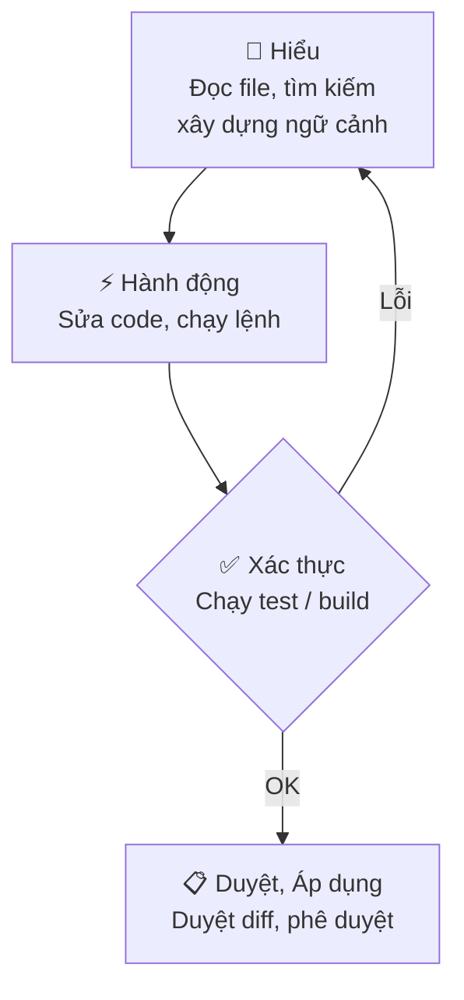

<!-- TOC start -->
- [GitHub Copilot](#github-copilot)
  - [🧩 Ý chính](#-ý-chính)
  - [💻 Ví dụ — Luồng làm việc cơ bản](#-ví-dụ--luồng-làm-việc-cơ-bản)
  - [⚠️ Lưu ý / Hạn chế](#️-lưu-ý--hạn-chế)
  - [🚀 3 Bước tiếp theo](#-3-bước-tiếp-theo)
  - [🗺️ Sơ đồ — Vòng lặp Agent](#️-sơ-đồ--vòng-lặp-agent)
<!-- TOC end -->

## GitHub Copilot

> GitHub Copilot tích hợp AI vào VS Code: agents tự động, gợi ý mã inline, chat nội tuyến và smart actions — giúp lập trình viên tạo feature, sửa lỗi và review code nhanh hơn.

### 🧩 Ý chính

- **Interaction surfaces** (bề mặt tương tác) — 4 chế độ: *Inline suggestions* (ghost text khi gõ), *Inline chat* (sửa cục bộ), *Chat / Agents* (tác vụ end-to-end), *Smart actions* (commit message, fix diagnostics).
- **Agent loop** — vòng lặp **Understand → Act → Validate**: đọc context → chỉnh sửa / chạy lệnh → kiểm tra kết quả, tự lặp lại nếu cần.
- **Context window** — system prompt gồm custom instructions, lịch sử hội thoại, file hiện tại và tool outputs; dùng `#file`, `#codebase`, `#web` để thêm ngữ cảnh tường minh.
- **Agent types** — `Local` (realtime trong VS Code), `Background` (chạy nền), `Cloud` (tạo branch / PR tự động), `Third-party` (Anthropic, OpenAI, v.v.).
- **Stay in control** — review diff trước khi apply; phê duyệt tool calls có side effects; dùng checkpoints để revert.

> 📌 **Tóm tắt:** Copilot hoạt động theo vòng lặp **Understand → Act → Validate**; bạn luôn kiểm soát bằng cách review diff và approve trước khi áp dụng.

### 💻 Ví dụ — Luồng làm việc cơ bản

```bash
# 1. Mở Copilot Chat
Ctrl+Alt+I        # mở Chat view, chọn agent và nhập prompt

# 2. Inline suggestion (ghost text)
# Gõ code → Copilot hiện gợi ý → Tab để chấp nhận
# Alt+] / Alt+[ để duyệt các gợi ý khác

# 3. Inline chat — sửa đoạn code đang chọn
Ctrl+I            # mở inline chat ngay trong editor

# 4. Khởi tạo hướng dẫn dự án
/init             # tự động sinh .github/copilot-instructions.md
```

> 💡 **Giải thích:** Chạy `/init` một lần khi bắt đầu dự án để agent tự sinh file convention — các lần dùng tiếp theo agent sẽ hiểu ngữ cảnh dự án ngay lập tức.

### ⚠️ Lưu ý / Hạn chế

- ❌ **Tránh:** tin tưởng output mà không kiểm tra — mã trông hợp lý nhưng có thể dùng API cũ hoặc có lỗi logic; **luôn chạy test**.
- ⚠️ **Nondeterminism:** cùng một prompt có thể trả về kết quả khác nhau mỗi lần chạy.
- ⚠️ **Knowledge cutoff:** model bị giới hạn bởi dữ liệu huấn luyện; dùng `#web` để lấy thông tin mới nhất.
- ❌ **Prompt injection:** file hoặc web content độc hại có thể cố tình thay đổi hành vi agent — VS Code có cơ chế *trust* và *approval* để bảo vệ.
- ⚠️ **Context đầy:** khi context window tràn, dùng `/compact` hoặc mở session mới để duy trì hiệu suất.

### 🚀 3 Bước tiếp theo

1. Cài extension **GitHub Copilot** → đăng nhập GitHub → chạy `/init` để tự động cấu hình dự án.
2. Thử **inline suggestion** và **inline chat** (`Ctrl+I`) trên một đoạn code thực tế trong dự án của bạn.
3. Tạo `.github/copilot-instructions.md` hoặc custom agent riêng cho conventions của team.

### 🗺️ Sơ đồ — Vòng lặp Agent



*Hình 1: Vòng lặp hoạt động của Copilot Agent — Understand → Act → Validate → Review.*

---

> 🔗 **Tham khảo tiếp theo:** 
