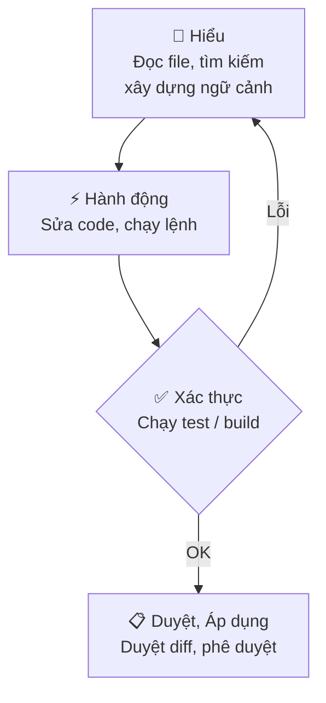

<!-- TOC start -->
- [GitHub Copilot](#github-copilot)
  - [🧩 Ý chính](#-ý-chính)
  - [Quickstart — Bắt đầu nhanh](#quickstart--bắt-đầu-nhanh)
- [Core Concepts — Chi tiết](#core-concepts--chi-tiết)
  - [⚠️ Lưu ý / Hạn chế](#️-lưu-ý--hạn-chế)
  - [🚀 3 Bước tiếp theo](#-3-bước-tiếp-theo)
  - [🗺️ Sơ đồ — Vòng lặp Agent](#️-sơ-đồ--vòng-lặp-agent)
- [Best Practices — Thực hành tốt nhất](#best-practices--thực-hành-tốt-nhất)
  - [1) Tối ưu hoá dự án (Project-level)](#1-tối-ưu-hoá-dự-án-project-level)
  - [2) Chọn công cụ đúng](#2-chọn-công-cụ-đúng)
  - [3) Viết prompt có hiệu quả](#3-viết-prompt-có-hiệu-quả)
  - [4) Cung cấp bối cảnh chính xác](#4-cung-cấp-bối-cảnh-chính-xác)
  - [5) Chọn model phù hợp](#5-chọn-model-phù-hợp)
  - [6) Plan \& Checkpoints](#6-plan--checkpoints)
  - [7) Review \& Verify](#7-review--verify)
  - [8) Quản lý context \& session](#8-quản-lý-context--session)
  - [9) Làm việc với repo lớn](#9-làm-việc-với-repo-lớn)
  - [Checklist nhanh trước khi chấp nhận thay đổi AI](#checklist-nhanh-trước-khi-chấp-nhận-thay-đổi-ai)
  - [Checklist tóm tắt (quan trọng nhất)](#checklist-tóm-tắt-quan-trọng-nhất)
<!-- TOC end -->


## GitHub Copilot

<div style="background:#f0f8ff;border-left:4px solid #0b5cff;padding:0.6rem;border-radius:6px;margin-bottom:0.5rem">
GitHub Copilot tích hợp AI vào VS Code: agents tự động, gợi ý mã inline, chat nội tuyến và smart actions — giúp lập trình viên tạo feature, sửa lỗi và review code nhanh hơn.

**Tóm tắt:** Copilot hoạt động theo vòng lặp **Understand → Act → Validate**; bạn luôn kiểm soát bằng cách review diff và approve trước khi áp dụng.
</div>

### 🧩 Ý chính

- **Interaction surfaces** (bề mặt tương tác) — 4 chế độ: *Inline suggestions* (ghost text khi gõ), *Inline chat* (sửa cục bộ), *Chat / Agents* (tác vụ end-to-end), *Smart actions* (commit message, fix diagnostics).
- **Agent loop** — vòng lặp **Understand → Act → Validate**: đọc context → chỉnh sửa / chạy lệnh → kiểm tra kết quả, tự lặp lại nếu cần.
- **Context window** — system prompt gồm custom instructions, lịch sử hội thoại, file hiện tại và tool outputs; dùng `#file`, `#codebase`, `#web` để thêm ngữ cảnh tường minh.
- **Agent types** — `Local` (realtime trong VS Code), `Background` (chạy nền), `Cloud` (tạo branch / PR tự động), `Third-party` (Anthropic, OpenAI, v.v.).
- **Stay in control** — review diff trước khi apply; phê duyệt tool calls có side effects; dùng checkpoints để revert.

> 📌 **Tóm tắt:** Copilot hoạt động theo vòng lặp **Understand → Act → Validate**; bạn luôn kiểm soát bằng cách review diff và approve trước khi áp dụng.

### Quickstart — Bắt đầu nhanh

```bash
# 1. Mở Copilot Chat
Ctrl+Alt+I        # mở Chat view, chọn agent và nhập prompt

# 2. Inline suggestion (ghost text)
# Gõ code → Copilot hiện gợi ý → Tab để chấp nhận
# Alt+] / Alt+[ để duyệt các gợi ý khác

# 3. Inline chat — sửa đoạn code đang chọn
Ctrl+I            # mở inline chat ngay trong editor

# 4. Khởi tạo hướng dẫn dự án
/init             # tự động sinh .github/copilot-instructions.md
```

> 💡 **Giải thích:** Chạy `/init` một lần khi bắt đầu dự án để agent tự sinh file convention — các lần dùng tiếp theo agent sẽ hiểu ngữ cảnh dự án ngay lập tức.

---

## Core Concepts — Chi tiết
> Những khái niệm nền tảng liên quan đến cách Copilot hoạt động (context, agent loop, kiểm soát, hạn chế).

### ⚠️ Lưu ý / Hạn chế

- ❌ **Tránh:** tin tưởng output mà không kiểm tra — mã trông hợp lý nhưng có thể dùng API cũ hoặc có lỗi logic; **luôn chạy test**.
- ⚠️ **Nondeterminism:** cùng một prompt có thể trả về kết quả khác nhau mỗi lần chạy.
- ⚠️ **Knowledge cutoff:** model bị giới hạn bởi dữ liệu huấn luyện; dùng `#web` để lấy thông tin mới nhất.
- ❌ **Prompt injection:** file hoặc web content độc hại có thể cố gắng thay đổi hành vi agent — VS Code có cơ chế *trust* và *approval* để bảo vệ.
- ⚠️ **Context đầy:** khi context window tràn, dùng `/compact` hoặc mở session mới để duy trì hiệu suất.

### 🚀 3 Bước tiếp theo

1. Cài extension **GitHub Copilot** → đăng nhập GitHub → chạy `/init` để tự động cấu hình dự án.
2. Thử **inline suggestion** và **inline chat** (`Ctrl+I`) trên một đoạn code thực tế trong dự án của bạn.
3. Tạo `.github/copilot-instructions.md` hoặc custom agent riêng cho conventions của team.

### 🗺️ Sơ đồ — Vòng lặp Agent

<div style="display:flex; justify-content:center">



</div>

<p style="text-align:center"><em>Hình 1: Vòng lặp hoạt động của Copilot Agent — Understand → Act → Validate → Review.</em></p>

---

## Best Practices — Thực hành tốt nhất

Dưới đây là các mục con đã tinh gọn và có ví dụ / checklist để bạn áp dụng nhanh trong dự án.

### 1) Tối ưu hoá dự án (Project-level)
- Chạy `/init` để sinh `.github/copilot-instructions.md` và các template prompt cơ bản.
- Viết `custom instructions` ngắn gọn: chỉ chứa quy ước, môi trường build, và thông tin team không thể suy ra từ code.
- Dùng `applyTo` để phân vùng scope theo ngôn ngữ/thư mục; tạo file prompt riêng cho tác vụ lặp.

> 💡 Ví dụ: `docs/prompts/ci-review.prompt` chứa checklist + tests cần chạy trước khi approve.

### 2) Chọn công cụ đúng
- **Inline suggestions:** hoàn thành nhanh, tên biến, boilerplate.
- **Inline chat:** sửa cục bộ, refactor nhỏ, thêm xử lý lỗi trong cùng tệp.
- **Chat / Ask:** nghiên cứu, giải thích, xây dựng design options.
- **Agents / Plan:** thay đổi đa-file — soạn plan → checkpoint → thực thi → review.

### 3) Viết prompt có hiệu quả
- Cấu trúc: Goal → Inputs → Constraints → Output format → Verification steps.
- Kèm test case/criteria (unit test) để AI tự kiểm tra kết quả.

Ví dụ ngắn:
```text
Viết hàm TypeScript validateEmail(email: string): boolean
- Trả về true/false
- Không dùng regex
- Tests: validateEmail("user@example.com")->true; validateEmail("x")->false
```

### 4) Cung cấp bối cảnh chính xác
- Sử dụng `#file`, `#folder`, `#symbol` để chỉ file hoặc vùng cần thay đổi.
- Đính kèm logs, test failures, output CLI để AI debug chính xác.

### 5) Chọn model phù hợp
- Dùng model nhanh cho boilerplate; model reasoning cho debug/thiết kế.
- Pin model nếu workflow cần kết quả nhất quán; cân nhắc BYOK cho yêu cầu bảo mật.

### 6) Plan & Checkpoints
- Trước thay đổi nhiều file: generate plan (agent), tạo checkpoint, review plan rồi thực thi.

### 7) Review & Verify
- Luôn review diff, chạy test, kiểm tra security/edge cases.
- Yêu cầu AI sinh unit tests khi viết code mới.

### 8) Quản lý context & session
- Bắt đầu session mới cho task không liên quan; compact hoặc xóa lịch sử nếu context nhiễu.

### 9) Làm việc với repo lớn
- Bật workspace/remote indexing; tách scope bằng multi-root workspaces.

### Checklist nhanh trước khi chấp nhận thay đổi AI

- [ ] Có test case/criterion kèm prompt
- [ ] Đã review diff và chạy tests
- [ ] Không có secret hardcoded
- [ ] Checkpoint đã tạo (nếu thay đổi nhiều file)
- [ ] Model & tool scope đã được ghim/giới hạn

### Checklist tóm tắt (quan trọng nhất)

- [ ] Chạy `/init` và có `copilot-instructions.md`
- [ ] Viết prompt kèm 1 test case rõ ràng
- [ ] Tạo checkpoint trước khi thay đổi nhiều file
- [ ] Review diff và chạy unit tests
- [ ] Không có secret trong prompt hoặc code


<div style="background:#f6ffef;border-left:4px solid #28a745;padding:0.6rem;border-radius:6px">
**📌 Tóm tắt:** Thiết lập project-level prompts và custom instructions; viết prompt rõ ràng kèm test; lập plan và checkpoint trước khi chạy agent; review + chạy test là bắt buộc.
</div>
