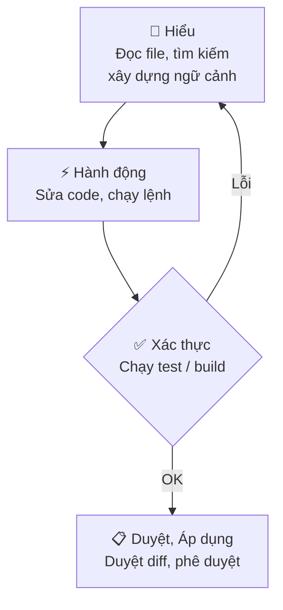

<!-- TOC start -->
- [GitHub Copilot](#github-copilot)
  - [🧩 Ý chính](#-ý-chính)
  - [Quickstart — Bắt đầu nhanh](#quickstart--bắt-đầu-nhanh)
- [Core Concepts — Chi tiết](#core-concepts--chi-tiết)
  - [⚠️ Lưu ý / Hạn chế](#️-lưu-ý--hạn-chế)
  - [🚀 3 Bước tiếp theo](#-3-bước-tiếp-theo)
  - [🗺️ Sơ đồ — Vòng lặp Agent](#️-sơ-đồ--vòng-lặp-agent)
  - [⚠️ Best Practices](#️-best-practices)
<!-- TOC end -->


## GitHub Copilot

> GitHub Copilot tích hợp AI vào VS Code: agents tự động, gợi ý mã inline, chat nội tuyến và smart actions — giúp lập trình viên tạo feature, sửa lỗi và review code nhanh hơn.

### 🧩 Ý chính

- **Interaction surfaces** (bề mặt tương tác) — 4 chế độ: *Inline suggestions* (ghost text khi gõ), *Inline chat* (sửa cục bộ), *Chat / Agents* (tác vụ end-to-end), *Smart actions* (commit message, fix diagnostics).
- **Agent loop** — vòng lặp **Understand → Act → Validate**: đọc context → chỉnh sửa / chạy lệnh → kiểm tra kết quả, tự lặp lại nếu cần.
- **Context window** — system prompt gồm custom instructions, lịch sử hội thoại, file hiện tại và tool outputs; dùng `#file`, `#codebase`, `#web` để thêm ngữ cảnh tường minh.
- **Agent types** — `Local` (realtime trong VS Code), `Background` (chạy nền), `Cloud` (tạo branch / PR tự động), `Third-party` (Anthropic, OpenAI, v.v.).
- **Stay in control** — review diff trước khi apply; phê duyệt tool calls có side effects; dùng checkpoints để revert.

> 📌 **Tóm tắt:** Copilot hoạt động theo vòng lặp **Understand → Act → Validate**; bạn luôn kiểm soát bằng cách review diff và approve trước khi áp dụng.

### Quickstart — Bắt đầu nhanh

```bash
# 1. Mở Copilot Chat
Ctrl+Alt+I        # mở Chat view, chọn agent và nhập prompt

# 2. Inline suggestion (ghost text)
# Gõ code → Copilot hiện gợi ý → Tab để chấp nhận
# Alt+] / Alt+[ để duyệt các gợi ý khác

# 3. Inline chat — sửa đoạn code đang chọn
Ctrl+I            # mở inline chat ngay trong editor

# 4. Khởi tạo hướng dẫn dự án
/init             # tự động sinh .github/copilot-instructions.md
```

> 💡 **Giải thích:** Chạy `/init` một lần khi bắt đầu dự án để agent tự sinh file convention — các lần dùng tiếp theo agent sẽ hiểu ngữ cảnh dự án ngay lập tức.

---

## Core Concepts — Chi tiết
> Những khái niệm nền tảng liên quan đến cách Copilot hoạt động (context, agent loop, kiểm soát, hạn chế).

### ⚠️ Lưu ý / Hạn chế

- ❌ **Tránh:** tin tưởng output mà không kiểm tra — mã trông hợp lý nhưng có thể dùng API cũ hoặc có lỗi logic; **luôn chạy test**.
- ⚠️ **Nondeterminism:** cùng một prompt có thể trả về kết quả khác nhau mỗi lần chạy.
- ⚠️ **Knowledge cutoff:** model bị giới hạn bởi dữ liệu huấn luyện; dùng `#web` để lấy thông tin mới nhất.
- ❌ **Prompt injection:** file hoặc web content độc hại có thể cố gắng thay đổi hành vi agent — VS Code có cơ chế *trust* và *approval* để bảo vệ.
- ⚠️ **Context đầy:** khi context window tràn, dùng `/compact` hoặc mở session mới để duy trì hiệu suất.

### 🚀 3 Bước tiếp theo

1. Cài extension **GitHub Copilot** → đăng nhập GitHub → chạy `/init` để tự động cấu hình dự án.
2. Thử **inline suggestion** và **inline chat** (`Ctrl+I`) trên một đoạn code thực tế trong dự án của bạn.
3. Tạo `.github/copilot-instructions.md` hoặc custom agent riêng cho conventions của team.

### 🗺️ Sơ đồ — Vòng lặp Agent

<div style="display:flex; justify-content:center">



</div>

<p style="text-align:center"><em>Hình 1: Vòng lặp hoạt động của Copilot Agent — Understand → Act → Validate → Review.</em></p>

---

### ⚠️ Best Practices

Dưới đây là các thực hành đã được kiểm chứng để sử dụng AI (Copilot) hiệu quả trong VS Code. Nội dung tổng hợp từ tài liệu chính thức và được chắt lọc thành các bước hành động.

- **Tối ưu hoá dự án cho AI:** Thêm file hướng dẫn dự án (custom instructions) và `prompt` tái sử dụng để cung cấp bối cảnh kiến trúc, quy ước mã, và thông tin môi trường mà AI không thể suy ra từ mã nguồn. Sử dụng `/init` để sinh cấu hình cơ bản.
- **Chọn công cụ phù hợp:** Dùng *inline suggestions* cho hoàn thành nhanh; *Ask/chat* để khám phá; *Inline chat* cho sửa đổi cục bộ; *Agents* cho thay đổi đa-file hoặc tác vụ tự động hóa.
- **Viết prompt hiệu quả:** Cụ thể hoá đầu vào/đầu ra, kèm ví dụ và tiêu chí kiểm định; chia nhiệm vụ lớn thành bước nhỏ; yêu cầu AI hỏi câu hỏi làm rõ nếu thông tin thiếu.
- **Cung cấp bối cảnh chính xác:** Trỏ AI tới file/folder/symbol cụ thể bằng `#<file>`/`#<folder>`/`#<symbol>`, hoặc dùng `#fetch`/`#githubRepo` để lấy tài liệu ngoài mã nguồn.
- **Chọn model phù hợp:** Dùng model nhanh cho boilerplate, model reasoning cho thiết kế/điều tra; ghim model trong prompt hoặc agent khi cần độ nhất quán; thử nghiệm khi cần.
- **Lập kế hoạch trước khi thực hiện:** Với thay đổi lớn, dùng chế độ *Plan* để soạn bước thực hiện, duyệt kế hoạch, rồi chạy *Agent* để triển khai từng bước; tạo *checkpoints* để có thể quay lại.
- **Kiểm tra và xác minh kết quả của AI:** Luôn review mã do AI sinh ra; cung cấp unit test trong prompt và chạy test sau khi AI thay đổi mã; kiểm tra các lỗ hổng bảo mật và không đưa thông tin nhạy cảm vào prompt.
- **Quản lý context và session:** Bắt đầu session mới cho nhiệm vụ không liên quan; xóa lịch sử không cần thiết; dùng subagents hoặc phiên nền để tránh làm rối bối cảnh chính.
- **Làm việc với codebase lớn:** Sử dụng indexing/remote indexing, chia workspace bằng multi-root, cung cấp hướng dẫn dự án ở mức module, và chạy các phiên song song cho các tác vụ độc lập.

> 📌 **Tóm tắt:** Thiết lập dự án, viết prompt rõ ràng, kiểm tra kỹ đầu ra, và sử dụng model & chế độ phù hợp là các bước then chốt để tận dụng Copilot an toàn và hiệu quả.
