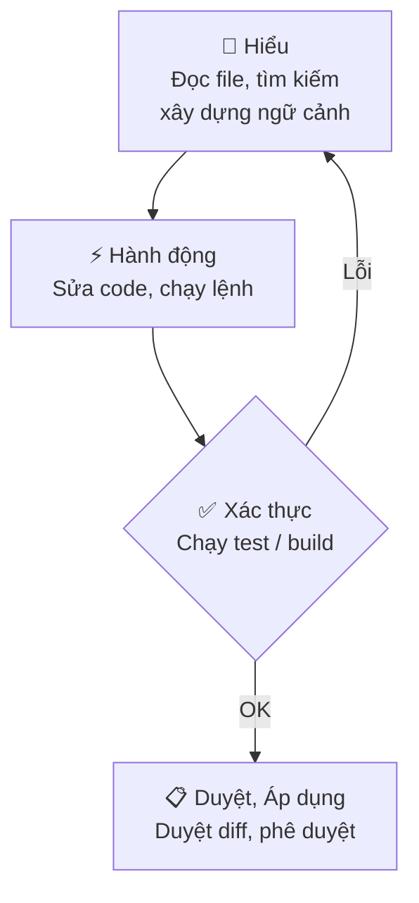

<!-- TOC start -->
- [GitHub Copilot](#github-copilot)
  - [🧩 Ý chính](#-ý-chính)
  - [Quickstart — Bắt đầu nhanh](#quickstart--bắt-đầu-nhanh)
- [Core Concepts — Chi tiết](#core-concepts--chi-tiết)
  - [⚠️ Lưu ý / Hạn chế](#️-lưu-ý--hạn-chế)
  - [🚀 3 Bước tiếp theo](#-3-bước-tiếp-theo)
  - [🗺️ Sơ đồ — Vòng lặp Agent](#️-sơ-đồ--vòng-lặp-agent)
  - [⚠️ Best Practices](#️-best-practices)
<!-- TOC end -->


## GitHub Copilot

<div style="background:#f0f8ff;border-left:4px solid #0b5cff;padding:0.6rem;border-radius:6px;margin-bottom:0.5rem">
GitHub Copilot tích hợp AI vào VS Code: agents tự động, gợi ý mã inline, chat nội tuyến và smart actions — giúp lập trình viên tạo feature, sửa lỗi và review code nhanh hơn.

**Tóm tắt:** Copilot hoạt động theo vòng lặp **Understand → Act → Validate**; bạn luôn kiểm soát bằng cách review diff và approve trước khi áp dụng.
</div>

### 🧩 Ý chính

- **Interaction surfaces** (bề mặt tương tác) — 4 chế độ: *Inline suggestions* (ghost text khi gõ), *Inline chat* (sửa cục bộ), *Chat / Agents* (tác vụ end-to-end), *Smart actions* (commit message, fix diagnostics).
- **Agent loop** — vòng lặp **Understand → Act → Validate**: đọc context → chỉnh sửa / chạy lệnh → kiểm tra kết quả, tự lặp lại nếu cần.
- **Context window** — system prompt gồm custom instructions, lịch sử hội thoại, file hiện tại và tool outputs; dùng `#file`, `#codebase`, `#web` để thêm ngữ cảnh tường minh.
- **Agent types** — `Local` (realtime trong VS Code), `Background` (chạy nền), `Cloud` (tạo branch / PR tự động), `Third-party` (Anthropic, OpenAI, v.v.).
- **Stay in control** — review diff trước khi apply; phê duyệt tool calls có side effects; dùng checkpoints để revert.

> 📌 **Tóm tắt:** Copilot hoạt động theo vòng lặp **Understand → Act → Validate**; bạn luôn kiểm soát bằng cách review diff và approve trước khi áp dụng.

### Quickstart — Bắt đầu nhanh

```bash
# 1. Mở Copilot Chat
Ctrl+Alt+I        # mở Chat view, chọn agent và nhập prompt

# 2. Inline suggestion (ghost text)
# Gõ code → Copilot hiện gợi ý → Tab để chấp nhận
# Alt+] / Alt+[ để duyệt các gợi ý khác

# 3. Inline chat — sửa đoạn code đang chọn
Ctrl+I            # mở inline chat ngay trong editor

# 4. Khởi tạo hướng dẫn dự án
/init             # tự động sinh .github/copilot-instructions.md
```

> 💡 **Giải thích:** Chạy `/init` một lần khi bắt đầu dự án để agent tự sinh file convention — các lần dùng tiếp theo agent sẽ hiểu ngữ cảnh dự án ngay lập tức.

---

## Core Concepts — Chi tiết
> Những khái niệm nền tảng liên quan đến cách Copilot hoạt động (context, agent loop, kiểm soát, hạn chế).

### ⚠️ Lưu ý / Hạn chế

- ❌ **Tránh:** tin tưởng output mà không kiểm tra — mã trông hợp lý nhưng có thể dùng API cũ hoặc có lỗi logic; **luôn chạy test**.
- ⚠️ **Nondeterminism:** cùng một prompt có thể trả về kết quả khác nhau mỗi lần chạy.
- ⚠️ **Knowledge cutoff:** model bị giới hạn bởi dữ liệu huấn luyện; dùng `#web` để lấy thông tin mới nhất.
- ❌ **Prompt injection:** file hoặc web content độc hại có thể cố gắng thay đổi hành vi agent — VS Code có cơ chế *trust* và *approval* để bảo vệ.
- ⚠️ **Context đầy:** khi context window tràn, dùng `/compact` hoặc mở session mới để duy trì hiệu suất.

### 🚀 3 Bước tiếp theo

1. Cài extension **GitHub Copilot** → đăng nhập GitHub → chạy `/init` để tự động cấu hình dự án.
2. Thử **inline suggestion** và **inline chat** (`Ctrl+I`) trên một đoạn code thực tế trong dự án của bạn.
3. Tạo `.github/copilot-instructions.md` hoặc custom agent riêng cho conventions của team.

### 🗺️ Sơ đồ — Vòng lặp Agent

<div style="display:flex; justify-content:center">



</div>

<p style="text-align:center"><em>Hình 1: Vòng lặp hoạt động của Copilot Agent — Understand → Act → Validate → Review.</em></p>

---

### ⚠️ Best Practices

Dưới đây là các thực hành chi tiết và hành động cụ thể để tận dụng Copilot hiệu quả trong dự án của bạn. Nguồn: hướng dẫn chính thức của VS Code (Best practices).

- **Tối ưu hoá dự án cho AI (project-level):**
  - Chạy `/init` để sinh file cấu hình khởi tạo (custom instructions).
  - Tạo `custom instructions` ngắn gọn, chỉ chứa thông tin AI không thể suy ra từ mã (quy ước đặt tên, kiến trúc, môi trường build).
  - Dùng `applyTo` trong file hướng dẫn để phân vùng scope theo ngôn ngữ hoặc thư mục (không nhồi mọi thứ vào 1 file).
  - Tạo `prompt` files cho tác vụ lặp lại (review, scaffolding) và ghim model nếu cần độ nhất quán.

- **Chọn công cụ đúng cho nhiệm vụ:**
  - *Inline suggestions* cho hoàn thành nhanh, boilerplate, tên biến.
  - *Inline chat* để sửa cục bộ hoặc thêm xử lý lỗi trong cùng tệp.
  - *Ask / Chat* để nghiên cứu, giải thích, brainstorm thiết kế.
  - *Agents / Plan* cho thay đổi đa-file: soạn plan → review → thực thi bằng agent.

- **Viết prompt có hiệu quả (prompt engineering):**
  - Luôn nêu rõ: inputs, outputs, constraints, ngôn ngữ, framework, và ví dụ đầu vào/đầu ra.
  - Kèm test case hoặc tiêu chí kiểm định để AI tự verify (ví dụ: unit test đơn giản).
  - Nếu nhiệm vụ lớn, chia nhỏ thành các bước rõ ràng và yêu cầu AI trả về checklist/step plan.
  - Yêu cầu AI đặt câu hỏi làm rõ nếu thông tin thiếu.

  Ví dụ ngắn:
  ```text
  Viết hàm TypeScript `validateEmail(email: string): boolean`.
  - Trả về true nếu hợp lệ, false nếu không.
  - Không dùng regex.
  - Tests: validateEmail("user@example.com") -> true; validateEmail("x") -> false.
  ```

- **Cung cấp bối cảnh đúng:**
  - Dẫn AI tới file/folder/symbol cụ thể bằng `#<file>`/`#<folder>`/`#<symbol>`.
  - Dùng `#fetch` hoặc `#githubRepo` để kéo tài liệu ngoài repo khi cần thông tin mới.
  - Đính kèm output thiết bị (log, test failures) để AI debug chính xác.

- **Chọn model phù hợp:**
  - Model nhanh cho boilerplate; model reasoning cho debugging/kiến trúc.
  - Pin model trong prompt/agent để đảm bảo nhất quán cho workflow quan trọng.
  - Xem xét BYOK nếu tổ chức cần host riêng hoặc tuân thủ chính sách.

- **Plan trước, rồi implement:**
  - Explore (ask/scan code) → Plan (dùng Plan agent) → Implement (agent với checkpoints).
  - Tạo checkpoints trước khi agent thay đổi nhiều file; review diff trước khi apply.

- **Review & verify output:**
  - Luôn review code do AI sinh ra; chú ý edge cases, performance, security.
  - Yêu cầu AI sinh unit tests trong prompt và chạy test sau khi áp dụng thay đổi.
  - Kiểm tra secret leaks, injections, và không gửi dữ liệu nhạy cảm vào prompt.

- **Quản lý context & sessions:**
  - Bắt đầu session mới cho tác vụ không liên quan; xóa lịch sử cũ khi bị nhiễu.
  - Dùng subagents/background sessions để tách nghiên cứu khỏi main session.

- **Làm việc với repository lớn:**
  - Bật workspace indexing / remote indexing cho repo lớn.
  - Sử dụng multi-root workspaces để giới hạn bối cảnh cho từng agent.
  - Chia task lớn thành nhiều agent session song song khi có thể.

**Checklist nhanh trước khi chấp nhận thay đổi AI**

- [ ] Có test case/criterion kèm prompt
- [ ] Đã review diff và chạy tests
- [ ] Không có secret hardcoded
- [ ] Checkpoint đã tạo (nếu thay đổi nhiều file)
- [ ] Model & tool scope đã được ghim/giới hạn

<div style="background:#f6ffef;border-left:4px solid #28a745;padding:0.6rem;border-radius:6px">
**📌 Tóm tắt:** Thiết lập dự án (custom instructions + prompt files), viết prompt rõ ràng với test, lập kế hoạch trước khi chạy agent, và luôn review + chạy test là chìa khoá để dùng Copilot an toàn và hiệu quả.
</div>
