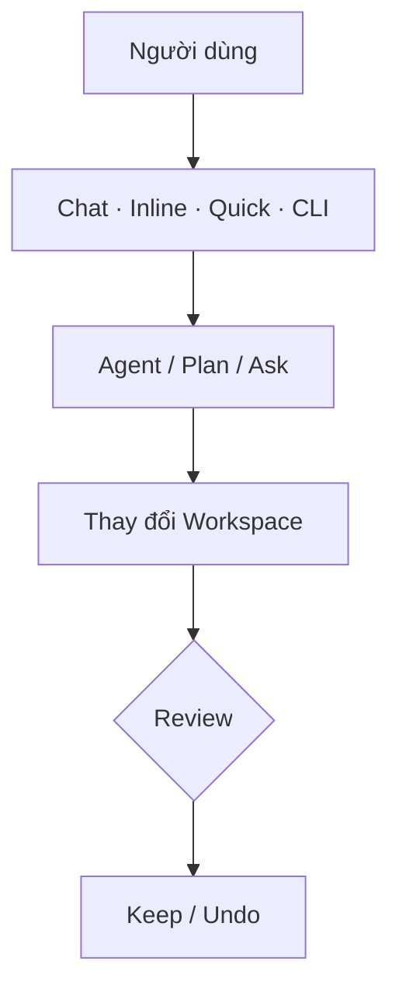

<!-- TOC start -->
- [Copilot Chat](#copilot-chat)
  - [🧩 Ý chính](#-ý-chính)
    - [Bề mặt truy cập](#bề-mặt-truy-cập)
    - [Gửi prompt đầu tiên](#gửi-prompt-đầu-tiên)
    - [Gửi tin nhắn khi đang chạy](#gửi-tin-nhắn-khi-đang-chạy)
    - [Cấu hình phiên làm việc](#cấu-hình-phiên-làm-việc)
    - [Thêm ngữ cảnh vào prompt](#thêm-ngữ-cảnh-vào-prompt)
    - [Review \& quản lý thay đổi](#review--quản-lý-thay-đổi)
    - [Tối ưu phản hồi](#tối-ưu-phản-hồi)
    - [💻 Ví dụ](#-ví-dụ)
    - [⚠️ Lưu ý / Hạn chế](#️-lưu-ý--hạn-chế)
    - [🚀 3 Bước tiếp theo](#-3-bước-tiếp-theo)
    - [🗺️ Sơ đồ](#️-sơ-đồ)
  - [🗂️ Quản lý ngữ cảnh cho AI](#️-quản-lý-ngữ-cảnh-cho-ai)
    - [#-mentions — Tham chiếu file, symbol, công cụ](#-mentions--tham-chiếu-file-symbol-công-cụ)
    - [@-mentions — Chat participants](#-mentions--chat-participants)
    - [Vision — Đính kèm ảnh](#vision--đính-kèm-ảnh)
    - [Browser elements — Phần tử trình duyệt](#browser-elements--phần-tử-trình-duyệt)
    - [Theo dõi \& thu gọn context window](#theo-dõi--thu-gọn-context-window)
  - [Nguồn](#nguồn)
<!-- TOC end -->

## Copilot Chat

> Copilot Chat là giao diện hội thoại AI tích hợp trong VS Code, cho phép hỏi đáp, tạo/sửa mã, điều phối agent tự động và quản lý phiên làm việc — tất cả qua ngôn ngữ tự nhiên.

### 🧩 Ý chính

#### Bề mặt truy cập

VS Code cung cấp nhiều bề mặt chat, mỗi bề mặt tối ưu cho một workflow riêng:

| Bề mặt | Phím tắt | Khi nào nên dùng |
|---|---|---|
| **Chat view** | Ctrl+Alt+I | Hội thoại nhiều bước, agentic workflows, sửa nhiều file cùng lúc |
| **Inline chat** | Ctrl+I | Chỉnh sửa hoặc gợi ý mã ngay tại vị trí đang làm việc trong editor/terminal |
| **Quick chat** | Ctrl+Shift+Alt+L | Câu hỏi nhanh mà không rời khỏi view hiện tại |
| **CLI** | `code chat` | Khởi động chat từ dòng lệnh bên ngoài VS Code |

#### Gửi prompt đầu tiên

1. Mở `Chat view` (Ctrl+Alt+I hoặc chọn **Chat** từ title bar).
2. Chọn **agent** từ agent picker để xác định vai trò xử lý.
3. Gõ prompt và nhấn Enter — agent tự lên kế hoạch, áp dụng thay đổi vào workspace và có thể chạy lệnh terminal.
4. **Review** các thay đổi trong editor và chọn Keep hoặc Undo.

#### Gửi tin nhắn khi đang chạy

Không cần chờ response xong mới gửi tin nhắn tiếp. Trong lúc request đang chạy, dùng dropdown trên nút **Send** để chọn:

| Tuỳ chọn | Hành vi |
|---|---|
| **Add to Queue** | Tin nhắn chờ, tự gửi sau khi response hiện tại hoàn thành |
| **Steer with Message** | Request hiện tại nhường chỗ, tin nhắn mới xử lý ngay |
| **Stop and Send** | Hủy request hiện tại và gửi tin nhắn mới ngay lập tức |

> ⚠️ **Lưu ý:** Message queuing và steering là tính năng đang thử nghiệm (experimental).

#### Cấu hình phiên làm việc

Ba lựa chọn quan trọng định hình cách AI phản hồi trong mỗi phiên:

**1. Nơi chạy (session type):**

| Kiểu | Đặc điểm | Phù hợp với |
|---|---|---|
| **Local** | Chạy tương tác trực tiếp trên máy | Khám phá nhanh, cần phản hồi tức thì |
| **Background** | Chạy tự động qua CLI trên máy | Tác vụ đã định nghĩa, không cần giám sát |
| **Cloud** | Chạy trên hạ tầng từ xa, tạo Pull Request | Cộng tác nhóm, tác vụ dài hạn |
| **Third‑party** | Dùng agent từ nhà cung cấp ngoài (Anthropic, OpenAI…) | Cần model không thuộc GitHub Copilot |

> 💡 **Mẹo:** Có thể **hand off** session từ kiểu này sang kiểu khác bất cứ lúc nào; toàn bộ lịch sử hội thoại được giữ nguyên.

**2. Loại agent (built-in):**

| Agent | Vai trò |
|---|---|
| **Agent** | Tự lên kế hoạch, áp dụng thay đổi workspace, gọi công cụ một cách tự chủ |
| **Plan** | Tạo kế hoạch từng bước có cấu trúc trước khi viết bất kỳ dòng code nào |
| **Ask** | Trả lời câu hỏi về code hoặc codebase, **không** thay đổi file |

Ngoài ra có thể tạo **custom agents** với role, tools và model riêng biệt cho workflow chuyên biệt.

**3. Mức phê duyệt (permission level):**

| Mức | Hành vi |
|---|---|
| **Default Approvals** | Hiện hộp thoại xác nhận theo cài đặt đã cấu hình |
| **Bypass Approvals** | Tự động chấp thuận tất cả tool calls, không cần xác nhận |
| **Autopilot *(Preview)*** | Tự chấp thuận, tự trả lời câu hỏi và tiếp tục làm việc đến khi hoàn thành |

**4. Mô hình ngôn ngữ:** Chọn model từ dropdown trong chat input — một số model tối ưu cho tốc độ (coding tasks), số khác tối ưu cho reasoning phức tạp. Danh sách model thay đổi theo subscription.

#### Thêm ngữ cảnh vào prompt

Cung cấp ngữ cảnh đúng giúp AI sinh ra kết quả chính xác và liên quan hơn:

| Loại | Cách dùng |
|---|---|
| **Implicit context** | VS Code tự đưa file đang mở, selection hiện tại vào context |
| **`#` mentions** | Tham chiếu cụ thể: `#file`, `#codebase`, `#terminalSelection`, `#fetch`, `#githubRepo` |
| **`@` mentions** | Gọi participants chuyên biệt: `@vscode`, `@terminal` |
| **Vision** | Đính kèm ảnh/screenshot/UI mockup làm ngữ cảnh thị giác |
| **Browser elements** *(Experimental)* | Chọn phần tử từ integrated browser → thêm HTML/CSS/screenshot vào prompt |

#### Review & quản lý thay đổi

- **Inline diffs:** Mở file đã thay đổi → xem diffs trực tiếp → dùng overlay controls để **Keep** hoặc **Undo** từng chỉnh sửa riêng lẻ.
- **Checkpoints:** VS Code tự động tạo snapshot tại các mốc quan trọng trong hội thoại — roll back về trạng thái trước bất cứ lúc nào.
- **Stage to accept:** Staging thay đổi trong Source Control View → tự động chấp nhận toàn bộ pending edits. Discard → cũng loại bỏ pending edits.

#### Tối ưu phản hồi

- **Viết prompt hiệu quả:** Mô tả cụ thể những gì muốn, tham chiếu file/symbol liên quan, dùng lệnh `/` cho các tác vụ phổ biến.
- **Tuỳ chỉnh AI:** Thêm `custom instructions`, tạo `prompt files` tái sử dụng, hoặc xây dựng `custom agents` cho workflow chuyên biệt.
- **Mở rộng với công cụ:** Kết nối MCP servers hoặc cài extensions để agent truy cập dịch vụ bên ngoài, database, hoặc API.
- **Gỡ lỗi hội thoại:** Dùng **Agent Logs** và **Chat Debug view** để xem event log, system prompt, context và payloads — hữu ích khi AI phản hồi không như mong đợi.

> 📌 **Tóm tắt:** Ba quyết định định hình mỗi phiên chat — *nơi chạy*, *loại agent*, và *mô hình* — quyết định phạm vi tự chủ và chất lượng đầu ra của AI.

#### 💻 Ví dụ

```text
Prompt: Create a basic calculator app with HTML, CSS, and JavaScript
```
> 💡 Agent tự tạo file HTML/CSS/JS, áp dụng thay đổi workspace. Mở `Chat view` (Ctrl+Alt+I) → chọn agent **Agent** → nhập prompt → Enter → Review diffs → **Keep** hoặc **Undo**.

#### ⚠️ Lưu ý / Hạn chế

- ❌ **Không chấp nhận mù quáng:** AI có thể sinh code không chính xác hoặc chứa lỗi bảo mật — luôn review trước khi merge.
- ⚠️ **Model thay đổi theo subscription:** Danh sách model khả dụng có thể cập nhật theo thời gian.
- ⚠️ **Tính năng experimental:** Message queuing/steering, Autopilot và Browser elements vẫn đang thử nghiệm.
- ⚠️ **Thận trọng với Autopilot:** Chỉ dùng với tác vụ đã xác định rõ và môi trường an toàn.

#### 🚀 3 Bước tiếp theo

1. Mở `Chat view` (Ctrl+Alt+I), thử prompt mẫu và review từng thay đổi bằng overlay controls.
2. Thực hiện cùng tác vụ trên các session type khác nhau (Local → Background → Cloud).
3. Tạo `prompt file` hoặc `custom instructions` để agent tự hiểu ngữ cảnh dự án.

#### 🗺️ Sơ đồ

<div align="center">



*Hình 1: Luồng cơ bản của Copilot Chat — từ chọn bề mặt, agent đến review thay đổi.*

</div>

---

### 🗂️ Quản lý ngữ cảnh cho AI

> Cung cấp ngữ cảnh đúng giúp AI sinh ra kết quả chính xác và liên quan hơn. Copilot Chat hỗ trợ nhiều cơ chế để thêm context vào prompt.

#### #-mentions — Tham chiếu file, symbol, công cụ

Gõ `#` trong ô chat để gọi context picker. Các loại tham chiếu phổ biến:

| Cú pháp | Tác dụng |
|---|---|
| `#file` | Đính kèm nội dung file cụ thể (full content hoặc outline nếu quá lớn) |
| `#codebase` | Cho phép Copilot tự tìm kiếm file liên quan trong toàn bộ workspace |
| `#terminalSelection` | Đưa output được chọn trong terminal vào context |
| `#fetch <URL>` | Tải nội dung trang web cụ thể làm context (có cache, cần xác nhận URL) |
| `#githubRepo <owner/repo>` | Tìm kiếm code trong một GitHub repository |

> 💡 **Mẹo:** Khi dùng agent, Copilot tự thêm context cần thiết qua `#codebase`. Vẫn có thể thêm `#codebase` thủ công nếu câu hỏi có thể bị hiểu nhiều nghĩa.

**Cách thêm file/folder vào context:**
- Gõ `#` rồi nhập tên file/folder/symbol.
- Drag & drop từ Explorer view, Search view hoặc editor tabs vào Chat view.
- Nhấn **Add Context** → chọn **Files & Folders** hoặc **Symbols**.

#### @-mentions — Chat participants

Chat participants là các assistant chuyên biệt cho từng domain cụ thể. Gọi bằng `@` theo sau là tên participant:

| Participant | Dùng khi |
|---|---|
| `@vscode` | Câu hỏi về tính năng, cài đặt của VS Code |
| `@terminal` | Câu hỏi về lệnh terminal, shell scripting |

> **Ví dụ:** `@vscode how to enable word wrapping` · `@terminal top 5 largest files`

Extensions cũng có thể đóng góp thêm chat participants riêng.

#### Vision — Đính kèm ảnh

Copilot Chat hỗ trợ vision: đính kèm ảnh (screenshot, UI mockup, code chụp màn hình) làm context để đặt câu hỏi hoặc yêu cầu implement.

> 💡 **Mẹo:** Có thể drag & drop ảnh từ trình duyệt web trực tiếp vào Chat view.

#### Browser elements — Phần tử trình duyệt

*(Experimental)* Chọn phần tử HTML/CSS từ integrated browser để thêm vào prompt:

1. Chạy web app và mở integrated browser (`Browser: Open Integrated Browser`).
2. Nhập URL cần tương tác.
3. Nhấn **Add Element to Chat**, di chuột chọn phần tử cần thêm.

Agent cũng có thể tự điều hướng và tương tác với trang (click, nhập text, chụp screenshot) khi bật `workbench.browser.enableChatTools = true`.

#### Theo dõi & thu gọn context window

- **Context window indicator:** thanh hiển thị % context đã dùng trong chat input box; hover để xem token count chi tiết (ví dụ: `15K/128K`).
- **Automatic compaction:** khi context window đầy, VS Code tự tóm tắt các tin nhắn cũ để tiếp tục phiên mà không mất thông tin quan trọng.
- **Manual compaction:** gõ `/compact` (kèm hướng dẫn tùy chọn, ví dụ `/compact focus on database schema`) hoặc nhấn **Compact Conversation** từ context window control.

> 📌 **Tóm tắt:** Ngữ cảnh tốt = phản hồi tốt. Dùng `#codebase` để tìm tự động, `#file` để chỉ định cụ thể, và `/compact` để giữ session dài mà không mất mạch.

---

###  Nguồn

- Nguồn chính: https://code.visualstudio.com/docs/copilot/chat/copilot-chat
- Quản lý chat sessions: https://code.visualstudio.com/docs/copilot/chat/chat-sessions
- Agents overview: https://code.visualstudio.com/docs/copilot/agents/overview
- Prompt examples: https://code.visualstudio.com/docs/copilot/chat/prompt-examples
- Prompt engineering guide: https://code.visualstudio.com/docs/copilot/guides/prompt-engineering-guide
